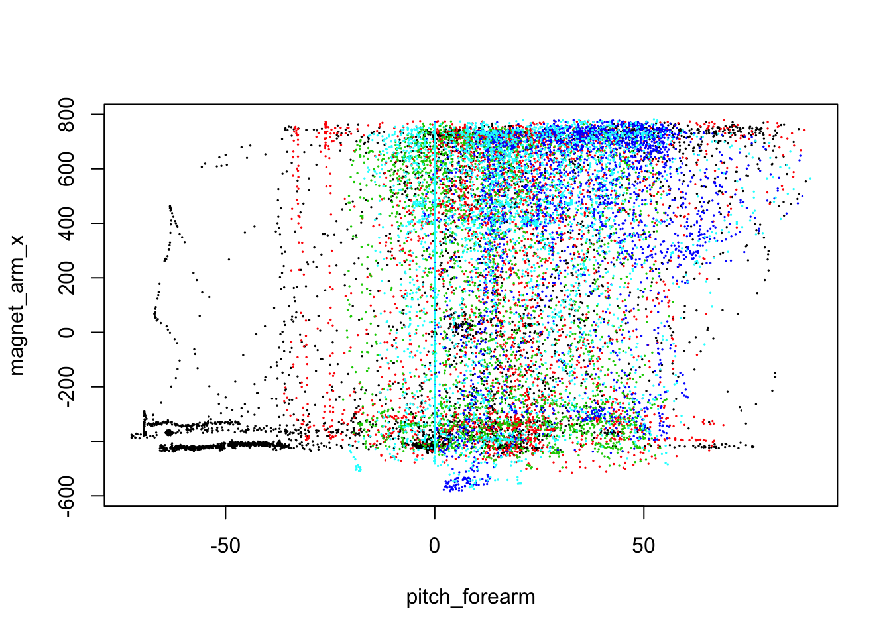
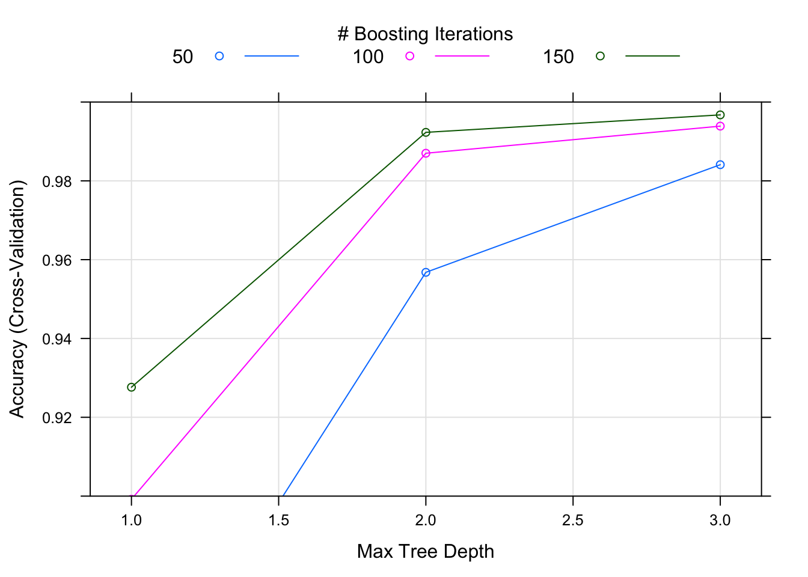
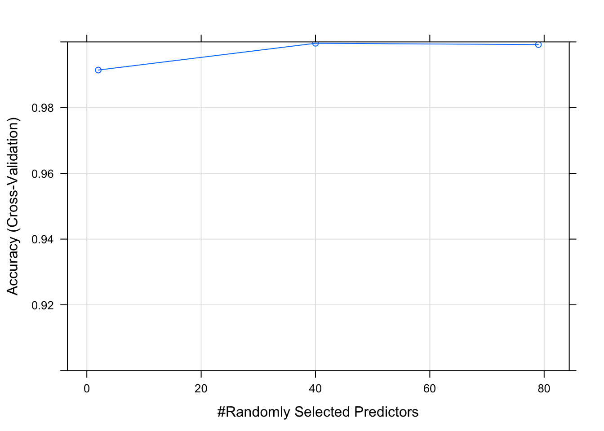

###Introduction
Using devices such as Jawbone Up, Nike FuelBand, and Fitbit it is now possible to collect a large amount of data about personal activity relatively inexpensively. These type of devices are part of the quantified self movement – a group of enthusiasts who take measurements about themselves regularly to improve their health, to find patterns in their behavior, or because they are tech geeks.

###Data
The data sets was originated from here:
Ugulino, W.; Cardador, D.; Vega, K.; Velloso, E.; Milidiu, R.; Fuks, H. Wearable Computing: Accelerometers' Data Classification of Body Postures and Movements. Proceedings of 21st Brazilian Symposium on Artificial Intelligence. Advances in Artificial Intelligence - SBIA 2012
Read more: http://groupware.les.inf.puc-rio.br/har#ixzz40iHm7JQz

###Goal
For this project, we are given data from accelerometers on the belt, forearm, arm, and dumbell of 6 research study participants. Our training_data data consists of accelerometer data and a label identifying the quality of the activity the participant was doing. Our testing_data data consists of accelerometer data without the identifying label. Our goal is to predict the labels for the test set observations.


```r
library(ggplot2)
library(caret)
```

```
## Error in library(caret): there is no package called 'caret'
```

```r
library(randomForest)
```

```
## Error in library(randomForest): there is no package called 'randomForest'
```

### Load data 
* Loading data.           
* Remove near zero covariates and those with more than 80% missing values since these variables will not provide much power for prediction.       
* Calculate correlations between each remaining feature to the response, `classe`. Use `spearman` rank based correlation because `classe` is a factor.                 
* Plot the two features that have highest correlation with `classe` and color with `classe` to see if we can separate response based on these features.            


```r
# loading data
training_data <- read.csv("data/pml-training.csv", row.names = 1)
testing_data <- read.csv("data/pml-testing.csv", row.names = 1)
# remove near zero covariates
nsv <- nearZeroVar(training_data, saveMetrics = T)
training_data <- training_data[, !nsv$nzv]
# remove variables with more than 80% missing values
nav <- sapply(colnames(training_data), function(x) if(sum(is.na(training_data[, x])) > 0.8*nrow(training_data)){return(T)}else{return(F)})
training_data <- training_data[, !nav]
# calculate correlations
cor <- abs(sapply(colnames(training_data[, -ncol(training_data)]), function(x) cor(as.numeric(training_data[, x]), as.numeric(training_data$classe), method = "spearman")))
```

```r
# plot predictors 
summary(cor)
```

```
## Error in object[[i]]: object of type 'closure' is not subsettable
```

```r
plot(training_data[, names(which.max(cor))], training_data[, names(which.max(cor[-which.max(cor)]))], col = training_data$classe, pch = 19, cex = 0.1, xlab = names(which.max(cor)), ylab = names(which.max(cor[-which.max(cor)])))
```

```
## Error in which.max(cor): cannot coerce type 'closure' to vector of type 'double'
```

The training_data set has __19622__ samples and __158__ potential predictors after filtering.          

There doesn't seem to be any strong predictors that correlates with `classe` well, so linear regression model is probably not suitable in this case. Boosting and random forests algorithms may generate more robust predictions for our data.         

### Boosting model
* Fit model with boosting algorithm and 10-fold cross validation to predict `classe` with all other predictors.    
* Plot accuracy of this model on the scale `[0.9, 1]`.        


```r
set.seed(123)
boostFit <- train(classe ~ ., method = "gbm", data = training_data, verbose = F, trControl = trainControl(method = "cv", number = 10))
```

```r
boostFit
```

```
## Error in eval(expr, envir, enclos): object 'boostFit' not found
```

```r
plot(boostFit, ylim = c(0.9, 1))
```

```
## Error in plot(boostFit, ylim = c(0.9, 1)): object 'boostFit' not found
```

The boosting algorithm generated a good model with __accuracy = 0.997__. 

### Random forests model   
* Fit model with random forests algorithm and 10-fold cross validation to predict `classe` with all other predictors.    
* Plot accuracy of the model on the __same scale__ as boosting model.            


```r
set.seed(123)
rfFit <- train(classe ~ ., method = "rf", data = training_data, importance = T, trControl = trainControl(method = "cv", number = 10))
```

```r
rfFit
```

```
## Error in eval(expr, envir, enclos): object 'rfFit' not found
```

```r
plot(rfFit, ylim = c(0.9, 1))
```

```
## Error in plot(rfFit, ylim = c(0.9, 1)): object 'rfFit' not found
```



```
## Error in eval(expr, envir, enclos): could not find function "varImp"
```

```
## Error in apply(imp, 1, max): object 'imp' not found
```

```
## Error in eval(expr, envir, enclos): object 'imp' not found
```

The random forests algorithm generated a very accurate model with __accuracy close to 1__. Compared to boosting model, this model generally has better performance in terms of accuracy as we see from the plots.                     

### Final model and prediction   
* Comparing model accuracy of the two models generated, random forests and boosting, random forests model has overall better accuracy. So, I'll use this model for prediction.         
* The final random forests model contains 500 trees with 40 variables tried at each split. The five most important predictors in this model are r rownames(imp)[1:5].                 
* Estimated __out of sample error rate__ for the random forests model is __0.04%__ as reported by the final model.            
* Predict the test set and output results for automatic grader.     


```r
# final model
rfFit$finalModel
```

```
## Error in eval(expr, envir, enclos): object 'rfFit' not found
```

```r
# prediction
(prediction <- as.character(predict(rfFit, testing_data)))
```

```
## Error in predict(rfFit, testing_data): object 'rfFit' not found
```

```r
# write prediction files
pml_write_files = function(x){
  n = length(x)
  for(i in 1:n)
  {
    filename = paste0("/prediction/problem_id_", i, ".txt")
    write.table(x[i], file = filename, quote = FALSE, row.names = FALSE, col.names = FALSE)
  }
}
pml_write_files(prediction)
```

